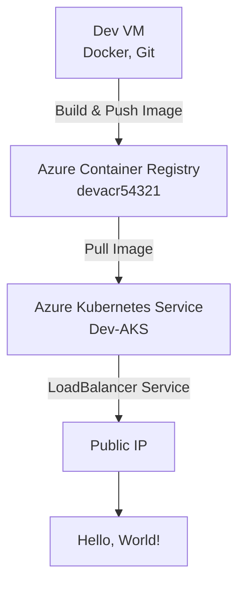
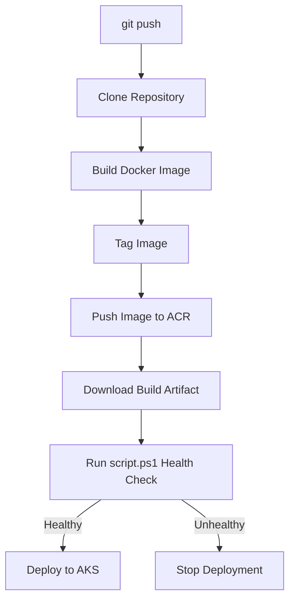
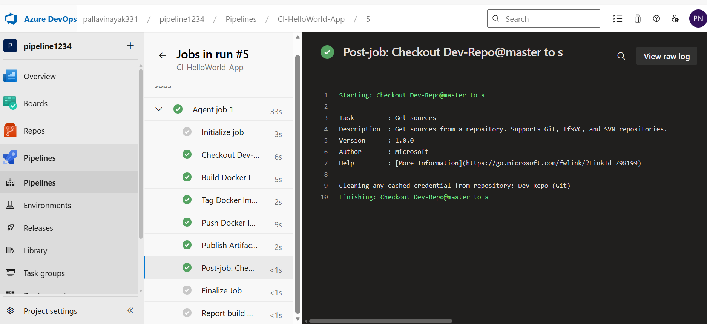
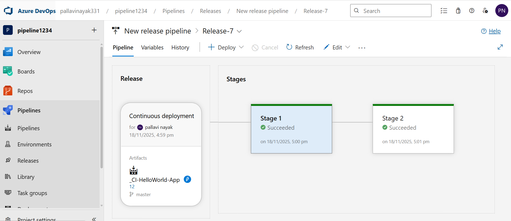
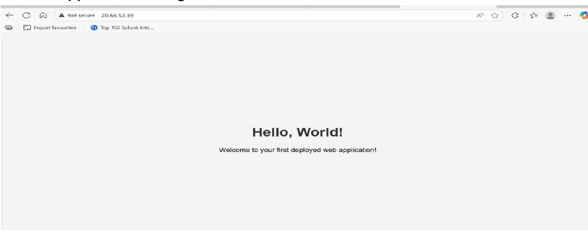

# Azure AKS CI/CD Pipeline Project

This project demonstrates an end-to-end CI/CD workflow using Azure DevOps, Azure Container Registry (ACR), and Azure Kubernetes Service (AKS).

## Key Features

- Containerized application using Docker
- Image storage in Azure Container Registry (ACR)
- Deployment to Azure Kubernetes Service (AKS)
- Automated CI/CD pipeline
- PowerShell-based health check before deployment
- Public exposure through Kubernetes LoadBalancer Service

## Project Structure

```text
azure-aks-cicd-pipeline/
├── app/
├── k8s/
├── scripts/
└── docs/
```
  
## Architecture Diagram



## CI/CD Workflow




## Resources provisioned

| Resource                  | Name              | Purpose |
|-----------------------------|--------------------|-----------|
| Resource Group              | `DevEnvironment-RG` | Groups all project resources |
| Virtual Network              | `Dev-VNet`          | 128-address network (`10.0.0.0/25`) |
| Subnet                       | `Dev-Subnet`        | 64-address subnet (`10.0.0.0/26`) |
| Network Security Group       | `Dev-NSG`           | Allows inbound HTTP (80) and SSH (22) only |
| Storage Account + Container  | `devstorage54321`  | Blob storage with a private container (`football-images`) |
| Virtual Machine              | `Dev-VM`            | Ubuntu 24.04 LTS — dev host for Docker, Git, kubectl |
| Azure Container Registry     | `devacr54321`      | Stores the built Docker image |
| Azure Kubernetes Service     | `Dev-AKS`           | Runs the containerized app (1 node, Standard_B2s) |
| Azure DevOps project         | `pipeline1234`     | Hosts the Git repo, CI pipeline, and release pipeline |

## Project structure

```
azure-aks-cicd-final/
├── app/
│   ├── index.html              # Static "Hello World" page
│   └── Dockerfile               # Containerizes the app with Nginx
├── k8s/
│   ├── deployment.yaml          # Deploys the app to AKS
│   └── service.yaml             # LoadBalancer — exposes the app publicly
├── scripts/
│   └── script.ps1                # Kubernetes health check, gates the release
└── docs/
    ├── walkthrough.md            # Full step-by-step build log
    └── screenshots/              # Evidence of each stage
```

## How it was built (summary)

1. **Networking** — Resource group, VNet, subnet, and an NSG allowing only HTTP/SSH
2. **Storage** — Storage account with a private blob container, access restricted to a specific IP
3. **Compute** — Ubuntu VM provisioned with Docker and Git
4. **App** — Static HTML page containerized with a minimal Nginx-based Dockerfile
5. **Registry** — Image built, tagged, and pushed to Azure Container Registry
6. **Cluster** — AKS cluster created and attached to ACR for pull access
7. **Deploy** — `kubectl apply` of a Deployment + a LoadBalancer Service, exposing the app on a public IP
8. **CI/CD** — Azure DevOps Classic Pipeline: CI builds and pushes the image; CD pulls it, runs a **PowerShell health check against the live cluster**, and only deploys if every node and pod reports healthy
9. **Boards** — Inherited Agile process, two 2-week sprints, and a custom rule that auto-assigns any new User Story to its creator

Full step-by-step detail (with the exact commands run at each stage) is in
[`docs/walkthrough.md`](docs/walkthrough.md).

## Result

The app is reachable over HTTP at the AKS LoadBalancer's public IP, serving
the deployed "Hello, World!" page — confirmed via `kubectl get svc` and a
browser screenshot in `docs/screenshots/`.

## Screenshots

**CI pipeline — build, tag, push (all stages passing)**


**CD pipeline — deploy + health-check gate**


**Live result**


## Tech stack

`Azure` (VNet, NSG, Storage, VM, ACR, AKS) · `Docker` · `Kubernetes` ·
`Azure DevOps (Classic Pipelines, Boards)` · `PowerShell` · `Nginx`
